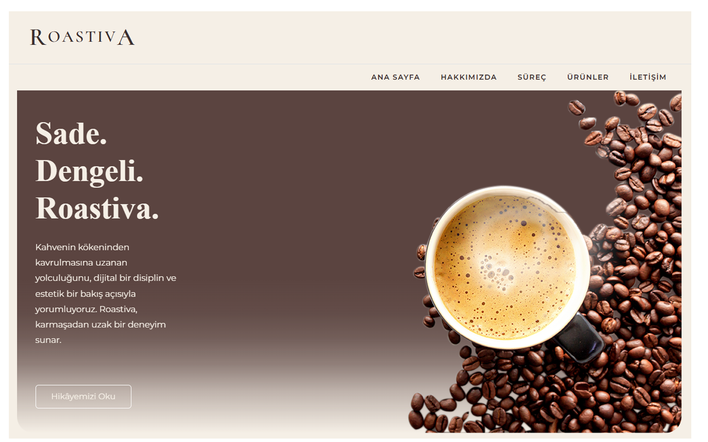

# Roastiva 

Roastiva, özel kavurma kahveleri için tasarlanmış
modern ve minimal bir ASP.NET MVC web projesidir.

## 🎯 Proje Amacı
- ASP.NET MVC mimarisini pekiştirmek
- Repository Pattern kullanmak
- Responsive ve markaya özel bir UI geliştirmek
- Gerçek bir ürün sitesi simülasyonu oluşturmak

## 🛠️ Kullanılan Teknolojiler
- ASP.NET Core MVC
- Entity Framework Core
- MSSQL
- Repository Pattern
- Bootstrap 5
- HTML5 / CSS3

## 📂 Proje Yapısı
- Controllers
- Models
- DataAccess (Repository Pattern)
- Views (Razor)
- wwwroot (CSS / Images)

## 📸 Ekran Görüntüleri

## 🚀 Kurulum
1. Projeyi klonla
2. Connection string’i `appsettings.json` içinde ayarla
3. `Update-Database` çalıştır
4. Uygulamayı başlat

## 👤 Geliştirici
**Belma Toykan**  
ASP.NET Developer
